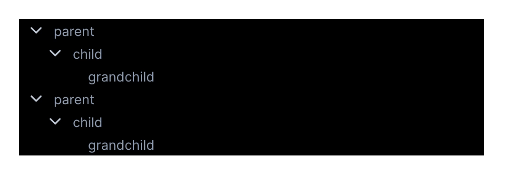

# Vue Teatree

A simple treeview component for VueJS with no added dependencies.



- [Vue Teatree](#vue-teatree)
  - [Install](#install)
  - [How it works](#how-it-works)
  - [NodeType](#nodetype)
  - [Props](#props)
  - [Styling](#styling)
  - [Common use cases](#common-use-cases)
    - [Toggle everything shut](#toggle-everything-shut)
    - [Hide leaves](#hide-leaves)
    - [Show a right-click menu](#show-a-right-click-menu)

## Install

```bash
yarn add vue-teatree # (or use npm)
```

<https://www.npmjs.com/package/vue-teatree>

## How it works

The Teatree treeview is purely a function of your data. If you want to make changes to the treeview (e.g. toggling children, hiding nodes etc.) you should modify the data object. With the exception of `showChildren`, Teatree will never mutate your data (the only way this can happen is if you write click handlers that do so).

## NodeType

Teatree accepts an array of [`NodeType`](./src/components/NodeType.ts) as its `roots` prop. This means you can render multiple roots in the treeview.

```ts
interface NodeType {
  // show: toggling this will show/hide the node and its children
  show: boolean;
  // showChildren: toggling this will toggle its children
  showChildren: boolean;
  // selected: toggling this will apply the "selected" CSS style
  selected: boolean;
  // children: the children must also conform to the node specification
  children: Array<NodeType>;
  // name: the name of the node
  name: string;
  // icon: base64 encoded icon (optional)
  icon?: string;
  // data: payload by the user of the library (optional)
  data?: object;
}
```

## Props

| Name                   | Type                                  | Required | Notes                                                    |
| ---------------------- | ------------------------------------- | -------- | -------------------------------------------------------- |
| `roots`                | `NodeType[]`                          | Yes      |                                                          |
| `handleNodeLeftClick`  | `(event: any, node: NodeType) => any` | Yes      | Pass an empty function `() => {}` if you don't have one. |
| `handleNodeRightClick` | `(event: any, node: NodeType) => any` | Yes      | Pass an empty function `() => {}` if you don't have one. |

## Styling

Import default styles using: `@import "vue-teatree/build/Teatree.css";`

Here are all the default styles. Override them to your liking:

```css
.teatree {
  cursor: pointer;
  height: 100%;
  overflow: hidden;
}

.teatree-node {
  padding-right: 0.25rem;
}

.teatree-node-item {
  display: flex;
  align-items: center;
  height: 1.5rem;
  background: transparent;

  /* hack to make hover the full width of parent */
  padding-left: 100%;
  margin-left: -100%;
  padding-right: 100%;
  margin-right: -100%;
}

.teatree-node-item:hover {
  background-color: #718096;
}

.teatree-node-item-selected {
  background-color: #718096;
}

.teatree-node-item-icon {
  display: flex;
  align-items: center;
  margin-left: 0.5rem;
  color: #cbd5e0;
}

.teatree-node-item-name {
  display: inline-block;
  font-size: 0.875rem;
  color: #a0aec0;
  margin-left: 0.5rem;
  user-select: none;

  /* truncate */
  overflow: hidden;
  text-overflow: ellipsis;
  white-space: nowrap;
}

.teatree-node-item-name-padded {
  padding-left: 1.5rem;
}

.teatree-node-item-name-padded-leaf {
  padding-left: 1.25rem;
}
```

## Common use cases

The following code/advice is not well tested. Apologies for any errors.

### Toggle everything shut

You can achieve an effect similar to VSCode where you can toggle/collapse all nodes closed. You need to write a simple tree-traversal:

```ts
const toggleTreeClosed = (rootNode: NodeType) => {
  rootNode.showChildren = false;
  rootNode.children.forEach((child) => toggleTreeClosed(child));
};
```

### Hide leaves

If you're using the treeview for a file explorer, it might be useful to hide the leaves, and only show the parent directories. You can use the `show` node property to hide the leaf nodes.

```ts
const isLeaf = (node: NodeType) => {
  return !node.children.length;
};

const hideTreeLeaves = (rootNode: NodeType) => {
  if (isLeaf(rootNode)) {
    rootNode.show = false;
  } else {
    rootNode.children.forEach((child) => hideTreeLeaves(child));
  }
};
```

### Show a right-click menu

You'll need something like: <https://github.com/rawilk/vue-context>.

Use the `handleNodeRightClick` component prop to call the context menu:

```ts
export default class MyComponent extends Vue {
  handleNodeRightClick(node: NodeType, event: any) {
    this.$refs.menu.open(event, node);
  }
}
```

```html
<vue-context ref="menu">
  <template slot-scope="child">
    <your-menu-component :node="child.data" />
  </template>
</vue-context>
```
